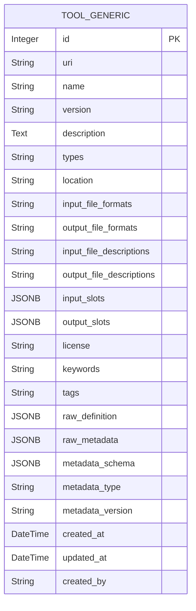

# toolmeta-models

Database models for the tools registry.

## Entity relationship diagram

<!-- BEGIN ERD -->

```mermaid
erDiagram
  TOOL_GENERIC {
    Integer id PK
    String uri
    String name
    String version
    Text description
    String types
    String location
    String input_file_formats
    String output_file_formats
    String input_file_descriptions
    String output_file_descriptions
    JSONB input_slots
    JSONB output_slots
    String license
    String keywords
    String tags
    JSONB raw_definition
    JSONB raw_metadata
    JSONB metadata_schema
    String metadata_type
    String metadata_version
    DateTime created_at
    DateTime updated_at
    String created_by
  }
```

<!-- END ERD -->
