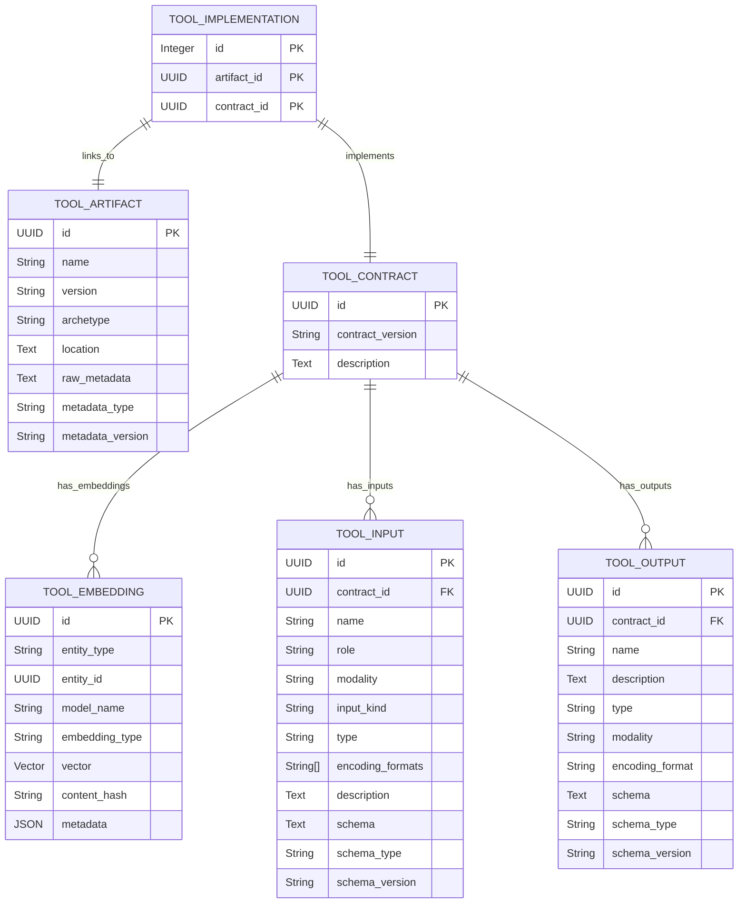

# toolmeta-models
Database models for the tools registry

## Entity relationship diagram

```mermaid
erDiagram
    %% Root table
    TOOL_IMPLEMENTATION {
        Integer id PK
        UUID artifact_id PK
        UUID contract_id PK
    }
    
    %% Artefact table
   TOOL_ARTIFACT {
        UUID id PK
        String name
        String version
        String archetype
        Text location
        Text raw_metadata
        String metadata_type
        String metadata_version
    }
    
    %% Tool contract table
    TOOL_CONTRACT {
        UUID id PK
        String contract_version
        Text description
    }

    TOOL_EMBEDDING {
        UUID id PK
        String entity_type
        UUID entity_id 
        String model_name
        String embedding_type
        Vector vector
        String content_hash
        JSON metadata
    }
    
    %% Inputs and outputs
    TOOL_INPUT {
        UUID id PK
        UUID contract_id FK
        String name
        String role
        String modality
        String input_kind
        String type
        String[] encoding_formats
        Text description
        Text schema
        String schema_type
        String schema_version
    }
    
    TOOL_OUTPUT {
        UUID id PK
        UUID contract_id FK
        String name
        Text description
        String type
        String modality
        String encoding_format
        Text schema
        String schema_type
        String schema_version
    }
    
    %% Relationships
    TOOL_IMPLEMENTATION ||--|| TOOL_ARTIFACT : links_to
    TOOL_IMPLEMENTATION ||--|| TOOL_CONTRACT : implements
    TOOL_CONTRACT ||--o{ TOOL_EMBEDDING : has_embeddings
    TOOL_CONTRACT ||--o{ TOOL_INPUT : has_inputs
    TOOL_CONTRACT ||--o{ TOOL_OUTPUT : has_outputs
```

